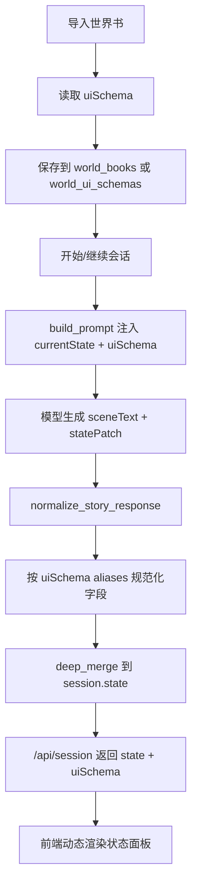

# 动态状态 UI Workflow

## 执行状态

更新时间：2026-06-08

- [x] Phase 1：文档与协议
- [x] Phase 2：导入与存储
- [x] Phase 3：Prompt 注入
- [x] Phase 4：Normalize 与兜底提取
- [x] Phase 5：动态前端
- [x] Phase 6：验证与回归

## 执行方案

| 阶段 | 目标 | 主要改动 | 验证 |
| --- | --- | --- | --- |
| Phase 1 | 固化协议 | 文档定义 `uiSchema`、字段类型、aliases、merge 策略 | 文档包含 RPG、侦探、恋爱、生存示例 |
| Phase 2 | 让世界书携带 schema | SQLite 增加 `ui_schema_json`，导入/编辑/API 透传 `uiSchema` | `/api/session` 和 `/api/editor` 能返回 schema |
| Phase 3 | 让模型按 schema 更新状态 | Prompt 注入 `uiSchema` 与 schema-derived rules | Prompt 中出现 schema 字段和 statePatch 规则 |
| Phase 4 | 让状态写入稳定 | 后端按 aliases 规范化 `statePatch`，正文提取 schema-aware | `Battle Power` 能归一到 `bp`，正文状态能被提取 |
| Phase 5 | 让 UI 动态展示 | 前端按 `world.uiSchema.sections` 渲染动态面板，保留 fallback | 有 schema 显示动态面板，无 schema 显示自动面板 |
| Phase 6 | 验证链路 | 编译、JS 语法、API、状态解析测试 | 所有检查通过 |

## 目标

不同世界书需要展示的状态并不一样。RPG 世界可能需要职业、等级、BP、技能和装备；侦探世界可能需要线索、嫌疑人、理智和案件进度；恋爱世界可能需要好感度、关系阶段、约会地点和承诺。

本 workflow 的目标是把“状态面板 UI”从固定 RPG 字段升级为可配置、可导入、可自动兜底的动态系统。

核心原则：

- 世界书声明“这个世界需要哪些状态”。
- Prompt 告诉模型必须按这些状态输出 `statePatch`。
- 后端保存并规范化状态。
- 前端根据 schema 动态渲染 UI。
- 没有 schema 时，使用自动识别和通用状态面板兜底。

## 酒馆类工具通常怎么解决

SillyTavern 本体更偏“聊天和上下文底座”，不天然知道每个世界书该显示什么 UI。常见方案是：

- 世界书或角色卡在提示词中约定状态格式。
- 作者用正则、Quick Reply、STScript 或扩展从模型回复里提取状态。
- 提取后的状态写入变量、记忆、消息或扩展自己的存储。
- 前端扩展或自定义 UI 再把变量显示成面板。

也就是说，酒馆生态常用的是“约定格式 + 脚本提取 + 扩展渲染”。我们这个项目可以把这条链路做成内置能力，减少每个世界书重复写脚本。

## 数据模型

### 世界书声明

世界书可以选择性提供 `uiSchema`。没有 `uiSchema` 时，系统继续使用自动识别。

```json
{
  "title": "Cyberpunk lorebook",
  "premise": "...",
  "uiSchema": {
    "title": "Battle Song",
    "sections": [
      {
        "title": "角色状态",
        "fields": [
          { "key": "class", "label": "职业", "type": "text", "aliases": ["Class", "job"] },
          { "key": "level", "label": "等级", "type": "number", "aliases": ["Level"] },
          { "key": "bp", "label": "BP", "type": "number", "aliases": ["Battle Power", "BP"] },
          { "key": "threatLevel", "label": "威胁", "type": "text", "aliases": ["Threat Level"] }
        ]
      },
      {
        "title": "能力",
        "fields": [
          { "key": "skills", "label": "技能", "type": "list", "aliases": ["Skills"] },
          { "key": "spells", "label": "法术", "type": "list", "aliases": ["Spells"] },
          { "key": "abilities", "label": "能力", "type": "list", "aliases": ["Abilities"] }
        ]
      },
      {
        "title": "携带物",
        "fields": [
          { "key": "equipment", "label": "装备", "type": "list", "aliases": ["Equipment"] },
          { "key": "inventory", "label": "物品", "type": "list", "aliases": ["Inventory"] }
        ]
      }
    ]
  }
}
```

### 字段类型

第一版建议只支持少量稳定类型：

| type | 用途 | 前端显示 |
| --- | --- | --- |
| `text` | 地点、职业、状态、阶段 | 单行文本 |
| `number` | 等级、BP、金币、理智值 | 数字卡片 |
| `meter` | HP、MP、好感度、进度 | 进度条 |
| `list` | 技能、线索、物品、任务 | chips 列表 |
| `tags` | 阵营、状态效果、风险 | 强调 chips |
| `object` | 复杂关系、资源表 | key-value 列表 |

后续再考虑 `image`、`grid`、`map`、`timeline` 等复杂类型。

## 运行流程



## Prompt 约定

Prompt 里要把 `uiSchema` 放在靠前位置，并明确告诉模型：

- 使用简体中文叙述。
- `statePatch` 只能写本轮新增、揭示或变化的状态。
- 如果本轮展示了状态面板，所有面板字段必须写入 `statePatch`。
- 字段 key 优先使用 schema 中的 `key`，不要随意创造同义字段。
- 如果世界书没有声明 schema，才允许使用自动字段，如 `location`、`inventory`、`relationship`、`activeQuests`。

示例 prompt 片段：

```text
状态 UI schema:
{
  "title": "调查档案",
  "sections": [
    {
      "title": "案件",
      "fields": [
        { "key": "sanity", "label": "理智", "type": "meter" },
        { "key": "clues", "label": "线索", "type": "list" }
      ]
    }
  ]
}

规则：
如果本轮发现新线索，必须在 statePatch.clues 中写入完整线索列表或新增线索。
如果理智发生变化，必须写 statePatch.sanity。
```

## 后端职责

### 导入阶段

`roleplay/library_import.py` 需要识别并保留：

- 顶层 `uiSchema`
- 顶层 `stateSchema`
- 世界书条目里类似 `[UI]`、`[State]`、`Status UI` 的专用条目

第一版可以只支持顶层 `uiSchema`，后续再做条目自动识别。

### 存储阶段

推荐新增字段或表：

```sql
ALTER TABLE world_books ADD COLUMN ui_schema_json TEXT NOT NULL DEFAULT '{}';
```

如果担心 SQLite 迁移复杂，也可以先把 `uiSchema` 放进 world dict 的扩展字段，在 API 返回时透传。

### 生成阶段

`roleplay/prompting.py`：

- 把 `world.uiSchema` 放进 prompt payload。
- 根据 schema 生成简短状态输出规则。
- 在 prompt 前部放 `currentState` 和 `uiSchema`，避免被截断。

`roleplay/story_response.py`：

- 继续接受模型返回的 `statePatch`。
- 根据 schema aliases 把同义字段规范化到统一 key。
- 如果模型把状态写在正文里，使用 schema aliases 尝试提取。
- 只把 schema 允许的字段写入动态 UI 面板，其他字段仍保留在 raw state。

### 状态合并策略

默认使用当前 `deep_merge`，但 list 字段要小心。

建议策略：

- `text/number/meter`：新值覆盖旧值。
- `list/tags`：默认覆盖；如果字段声明 `"merge": "appendUnique"`，则追加去重。
- `object`：递归 merge。

示例：

```json
{ "key": "clues", "label": "线索", "type": "list", "merge": "appendUnique" }
```

## 前端职责

前端状态栏分两层：

- 固定基础面板：章节、地点、时间、目标、模型。
- 动态世界面板：根据 `world.uiSchema.sections` 渲染。

渲染规则：

- `text` 显示为普通 key-value。
- `number` 显示为数字卡片。
- `meter` 显示为进度条，支持 `min/max`。
- `list/tags` 显示为 chips。
- `object` 显示为 key-value 列表。

没有 `uiSchema` 时：

- 使用当前 RPG 自动识别面板。
- 同时显示一个“其他状态”折叠区，列出没有被识别但存在于 `session.state` 的字段。

## 示例 Schema

### RPG / Isekai

```json
{
  "title": "Battle Song",
  "sections": [
    {
      "title": "状态",
      "fields": [
        { "key": "class", "label": "职业", "type": "text", "aliases": ["Class"] },
        { "key": "level", "label": "等级", "type": "number", "aliases": ["Level"] },
        { "key": "bp", "label": "BP", "type": "number", "aliases": ["Battle Power"] },
        { "key": "threatLevel", "label": "威胁", "type": "text", "aliases": ["Threat Level"] }
      ]
    },
    {
      "title": "能力",
      "fields": [
        { "key": "skills", "label": "技能", "type": "list" },
        { "key": "spells", "label": "法术", "type": "list" },
        { "key": "abilities", "label": "能力", "type": "list" }
      ]
    }
  ]
}
```

### 侦探 / 克苏鲁

```json
{
  "title": "调查档案",
  "sections": [
    {
      "title": "调查员",
      "fields": [
        { "key": "sanity", "label": "理智", "type": "meter", "min": 0, "max": 100 },
        { "key": "stress", "label": "压力", "type": "meter", "min": 0, "max": 10 },
        { "key": "location", "label": "地点", "type": "text" }
      ]
    },
    {
      "title": "案件",
      "fields": [
        { "key": "clues", "label": "线索", "type": "list", "merge": "appendUnique" },
        { "key": "suspects", "label": "嫌疑人", "type": "list", "merge": "appendUnique" }
      ]
    }
  ]
}
```

### 恋爱 / 社交

```json
{
  "title": "关系面板",
  "sections": [
    {
      "title": "关系",
      "fields": [
        { "key": "affection", "label": "好感度", "type": "meter", "min": 0, "max": 100 },
        { "key": "relationshipStage", "label": "关系阶段", "type": "text" },
        { "key": "promises", "label": "承诺", "type": "list", "merge": "appendUnique" },
        { "key": "tension", "label": "紧张度", "type": "meter", "min": 0, "max": 100 }
      ]
    }
  ]
}
```

### 生存

```json
{
  "title": "生存状态",
  "sections": [
    {
      "title": "身体",
      "fields": [
        { "key": "hp", "label": "生命", "type": "meter", "min": 0, "max": 100 },
        { "key": "hunger", "label": "饥饿", "type": "meter", "min": 0, "max": 100 },
        { "key": "thirst", "label": "口渴", "type": "meter", "min": 0, "max": 100 },
        { "key": "temperature", "label": "体温", "type": "text" }
      ]
    },
    {
      "title": "资源",
      "fields": [
        { "key": "tools", "label": "工具", "type": "list" },
        { "key": "materials", "label": "材料", "type": "list" }
      ]
    }
  ]
}
```

## 实施阶段

### Phase 1：文档与协议

- 定义 `uiSchema` JSON 格式。
- 定义字段类型、aliases、merge 策略。
- 更新 prompt 规则，要求 statePatch 使用 schema key。

验收：

- 文档内有 RPG、侦探、恋爱、生存四类 schema 示例。
- 旧世界书没有 schema 时仍能正常运行。

### Phase 2：导入与存储

状态：已完成。

完成记录：

- `world_books` 增加 `ui_schema_json` 字段，并在启动时自动迁移旧数据库。
- 世界书导入会保留顶层 `uiSchema`。
- 世界书编辑保存会保留 `uiSchema`。
- `/api/editor` 与 `/api/session` 返回的 world 均包含 `uiSchema`。

验证：

- `python -m compileall roleplay/storage.py roleplay/library_import.py` 通过。
- 本地检查 `session["world"]["uiSchema"]` 和 editor world `uiSchema` 均为 `dict`。

- `world_books` 增加 `ui_schema_json` 字段。
- 世界书导入时保留顶层 `uiSchema`。
- `/api/editor` 和 `/api/session` 返回 world 时带上 `uiSchema`。

验收：

- 带 `uiSchema` 的 JSON 世界书导入后，API 能返回 schema。
- 不带 schema 的旧世界书返回 `{}` 或 `null`，不报错。

### Phase 3：Prompt 注入

状态：已完成。

完成记录：

- `build_prompt()` 会把 `stateUiSchema` 放进 prompt payload。
- Prompt 会生成 schema 摘要，提醒模型使用 schema fields 的 `key` 写 `statePatch`。
- `currentState`、`stateUiSchema` 和连续性提醒放在 prompt 前部，降低被截断风险。

验证：

- 本地构造带 `clues` 字段的 schema，生成 prompt 后能看到 `stateUiSchema` 与 `clues`。

- `build_prompt()` 把 `uiSchema` 和 schema-derived rules 放到 prompt 前部。
- 当前状态 `currentState` 紧跟 schema，避免被截断。
- 让模型使用 schema key 写 `statePatch`。

验收：

- 使用侦探 schema 时，模型发现线索会写 `statePatch.clues`。
- 使用 RPG schema 时，模型打开 Status 会写 `statePatch.class/bp/skills`。

### Phase 4：Normalize 与兜底提取

状态：已完成。

完成记录：

- 新增 schema aliases 规范化：例如 `Battle Power` 可归一到 `bp`。
- 新增 schema-aware 正文提取：模型把 `Clues: ...` 写在正文时也能提取进 `statePatch.clues`。
- 新增 schema merge 策略：`merge: appendUnique` 支持列表追加去重。
- `generate_story()` 会在模型返回后按当前 world `uiSchema` 规范化。
- `append_assistant_turn()` 保存状态时按 schema merge 策略合并。

验证：

- 本地测试 `Battle Power` 归一到 `bp`。
- 本地测试正文 `Clues: red key, broken glass` 提取为 `clues` 列表。
- 本地测试 `appendUnique` 合并去重通过。

- `story_response.py` 根据 aliases 规范化 statePatch key。
- 正文提取器改为 schema-aware。
- list 字段按 schema merge 策略处理。

验收：

- 模型写 `Battle Power` 时保存为 `bp`。
- 模型把 `Clues: ...` 写在正文时，后端能提取到 `statePatch.clues`。

### Phase 5：动态前端

状态：已完成。

完成记录：

- 左侧栏新增 `dynamicStatePanels` 容器。
- 前端新增 `renderDynamicStatePanels()`，按 `world.uiSchema.sections` 渲染动态状态面板。
- 支持 `text`、`number`、`meter`、`list/tags`、`object` 类型。
- 有 schema 时隐藏固定 RPG fallback 面板；没有 schema 时继续显示自动识别 RPG 面板。

验证：

- `node --check static/app.js` 通过。
- 本地静态资源包含 `dynamicStatePanels` 与 `renderDynamicStatePanels`。

- 前端新增 `renderDynamicStatePanels(schema, state)`。
- 固定 RPG 面板降级为 fallback。
- 未被 schema 消费的字段进入“其他状态”区域。

验收：

- RPG 世界显示 Battle Song。
- 侦探世界显示调查档案。
- 恋爱世界显示关系面板。
- 没 schema 的世界仍显示基础状态和自动识别状态。

## 设计取舍

### 为什么不用完全自动识别

完全自动识别会遇到三个问题：

- 同一个字段不同世界含义不同，比如 `power` 可能是战力，也可能是电力。
- 模型字段名不稳定，比如 `BP`、`Battle Power`、`battle_power`。
- UI 类型无法确定，比如 `trust` 应该是数字、进度条还是关系标签。

所以自动识别只能做 fallback，长期可维护方案必须是 schema。

### 为什么不把 UI 写进世界书正文

世界书正文适合给模型读，不适合给前端直接解析。把 UI schema 做成结构化字段，可以：

- 避免自然语言解析错误。
- 让前端稳定渲染。
- 让模型明确知道哪些字段需要更新。
- 让不同世界书复用同一套引擎能力。

### 为什么保留 fallback RPG 面板

大量现成世界书不会提供 schema。保留自动 RPG 识别可以让 Isekai、LitRPG、Status 面板类世界开箱即用，同时不阻碍更通用的动态 schema。

## 推荐优先级

1. 先做 `uiSchema` 顶层字段导入和 API 透传。
2. 再做 prompt 注入，让模型开始稳定写 schema key。
3. 然后做前端动态渲染。
4. 最后把正文提取器升级成 schema-aware。

这样每一步都能独立带来收益，不需要一次性重构完整系统。

## 最终验收记录

状态：已完成。

验证命令：

```powershell
.\.venv\Scripts\python.exe -m compileall server.py roleplay
node --check static\app.js
```

验证结果：

- Python 编译通过。
- `static/app.js` 语法检查通过。
- 旧数据库启动时可自动补齐 `world_books.ui_schema_json`。
- `/api/session` 与 `/api/editor` 的 world 均返回 `uiSchema`。
- Prompt 中可注入 `stateUiSchema`。
- `Battle Power: 1200` 可按 schema aliases 归一为 `bp: 1200`。
- `Clues: red key, map` 可按 schema 提取为 `clues` 列表。
- `merge: appendUnique` 能合并列表并去重。
- 前端静态资源包含 `dynamicStatePanels`、`renderDynamicStatePanels` 与动态 meter 样式。
