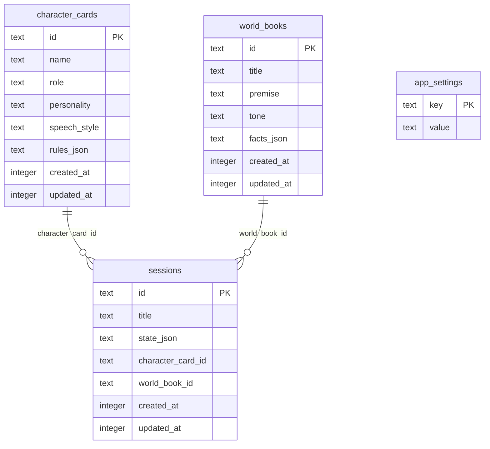
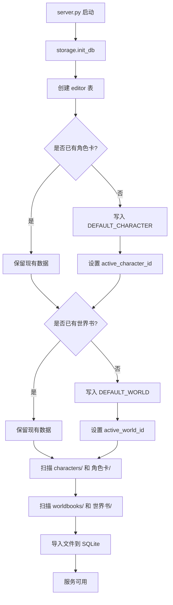
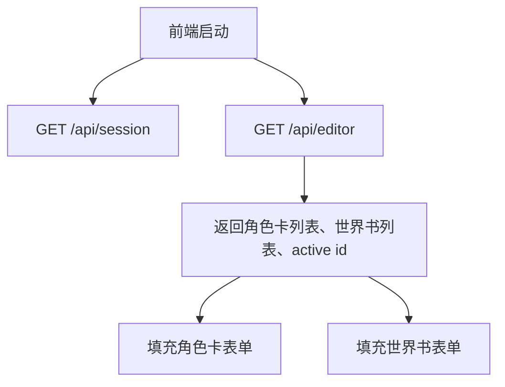
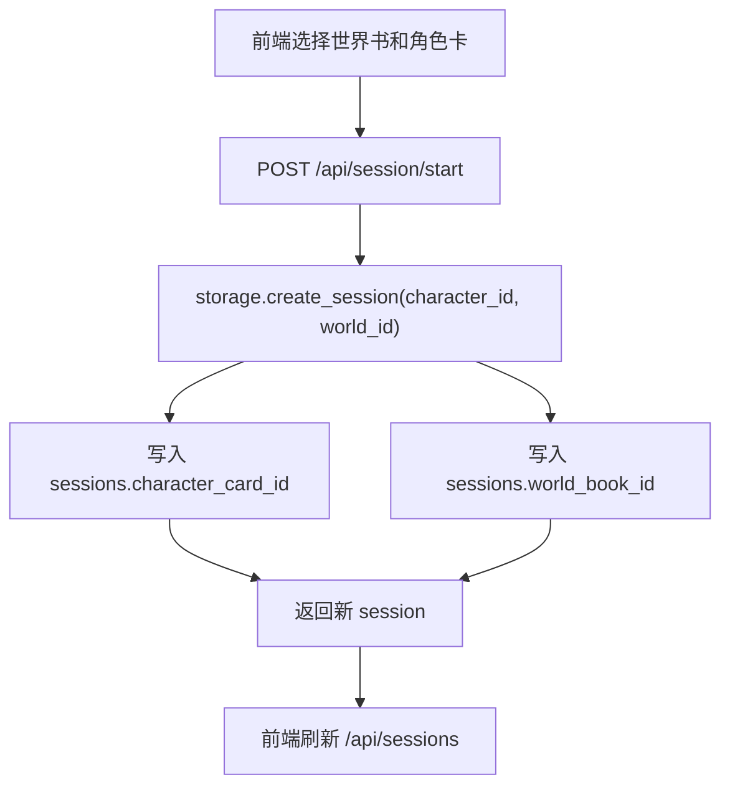
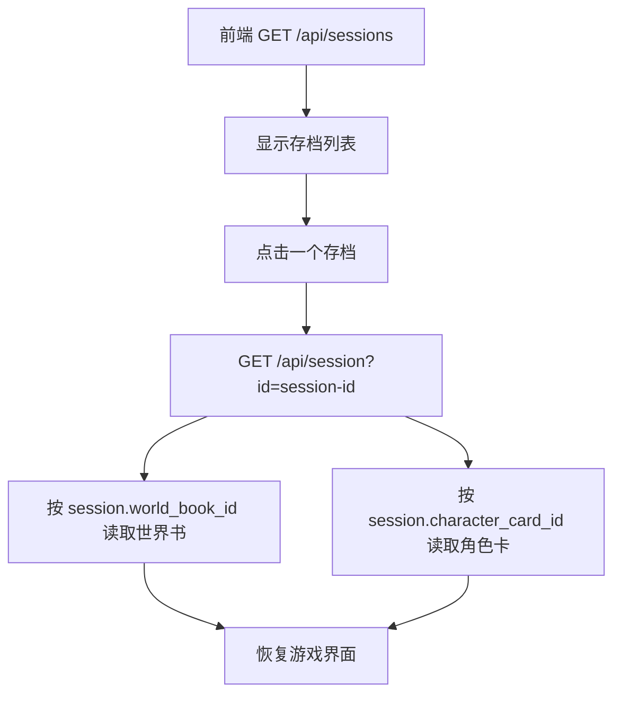
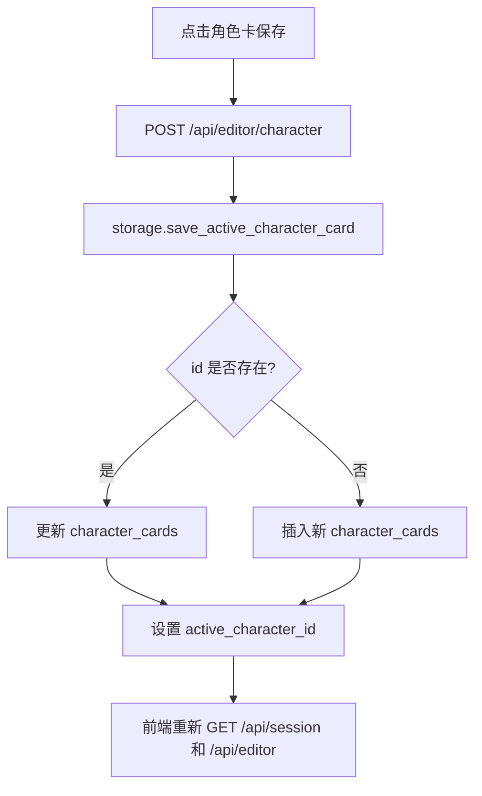
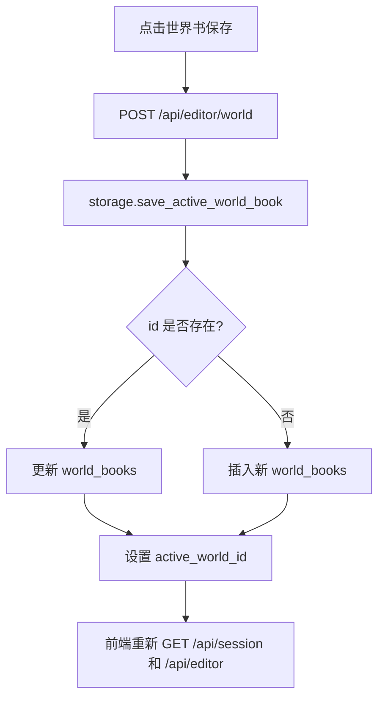
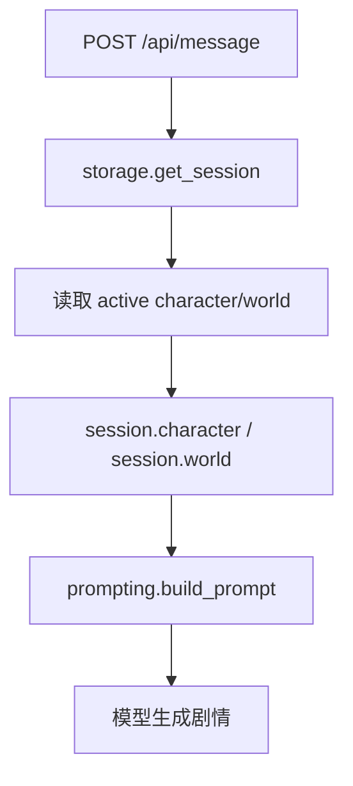

# 角色卡与世界书编辑器 Workflow

## 目标

把角色设定和世界设定从代码常量里解耦，变成可在本地页面编辑、保存并参与下一轮 Prompt 的数据。

MVP 采用“全局当前角色卡 + 全局当前世界书”模式：

- 当前激活角色卡会注入 `session.character`
- 当前激活世界书会注入 `session.world`
- 下一次 `POST /api/message` 会使用最新保存的设定
- 后续可扩展成多角色卡、多世界书、按存档绑定

## 代码结构

```text
roleplay/
  defaults.py        # 默认角色卡、默认世界书、默认状态
  storage.py         # SQLite 表、读取、保存、激活编辑器数据
  prompting.py       # 把 session.character/session.world 注入 Prompt
server.py            # 编辑器 API
static/
  index.html         # 角色卡和世界书表单
  app.js             # 编辑器加载、保存、刷新 session
  styles.css         # 编辑器表单样式
characters/          # 角色卡文件目录，支持 JSON 和 PNG 角色卡
worldbooks/          # 世界书文件目录，支持 JSON 世界书
角色卡/              # 兼容中文角色卡目录
世界书/              # 兼容中文世界书目录
```

## 数据表



`app_settings` 当前保存：

- `active_character_id`
- `active_world_id`

## 启动流程



## 文件目录导入

前端读取的是 SQLite，不会直接读取磁盘目录。启动服务时，`storage.init_db()` 会调用 `library_import.import_library_files()`，把目录里的文件同步进数据库，然后 `/api/editor` 才能返回给前端。

支持目录：

```text
characters/
角色卡/
worldbooks/
世界书/
```

支持格式：

- 角色卡：`.json`，SillyTavern `.png` 角色卡
- 世界书：`.json`，SillyTavern World Info / Lorebook 格式

已验证示例：

- `characters/default_Seraphina.png` -> `Seraphina`
- `worldbooks/Eldoria.json` -> `Eldoria`

## 编辑器读取流程



## 开始新游戏



请求体：

```json
{
  "worldId": "world-id",
  "characterId": "character-id"
}
```

## 继续存档



存档列表接口：

```text
GET /api/sessions
```

返回每个存档的世界书标题、角色名、消息数量和更新时间。

## 保存角色卡



请求体：

```json
{
  "id": "character-id",
  "name": "凌夜",
  "role": "旧城调查者",
  "personality": "克制、谨慎",
  "speechStyle": "短句为主",
  "rules": ["保持角色一致性", "不要替用户做决定"]
}
```

## 保存世界书



请求体：

```json
{
  "id": "world-id",
  "title": "雨夜旧城",
  "premise": "旧城被暴雨封住",
  "tone": "悬疑、沉浸",
  "facts": ["旧城北区十年前发生过大火", "旅馆二楼尽头的房间多年无人入住"]
}
```

## Prompt 接入



`prompting.py` 不直接读数据库，只消费 `session`。这样 Prompt 层不关心编辑器数据来自 SQLite、文件，还是未来的云端配置。

## MVP 边界

已支持：

- 编辑当前角色卡
- 编辑当前世界书
- SQLite 持久化
- 保存后立即影响下一轮 Prompt
- `/api/editor` 读取编辑器状态
- `/api/editor/character` 保存角色卡
- `/api/editor/world` 保存世界书
- `/api/session/start` 按所选世界书和角色卡开始新游戏
- `/api/sessions` 读取存档列表
- 继续旧存档时使用该存档绑定的世界书和角色卡

暂不支持：

- 多角色同时登场的编排
- 世界书条目检索和触发条件
- 世界书和角色卡文件导入导出
- 导入导出 Tavern / SillyTavern 等格式
- 世界书向量检索

## 后续扩展

1. 把 `world_books.facts_json` 拆成 `world_entries`，支持关键词、优先级、启用状态。
2. 增加角色卡列表的新建、复制、删除。
3. 增加 `角色卡/` 和 `世界书/` 的 JSON 导入导出。
4. 给 session 增加设定快照，避免后续编辑影响旧存档。
5. 在 PromptBuilder 中按关键词选择世界书条目，避免每轮塞入全部世界书。
