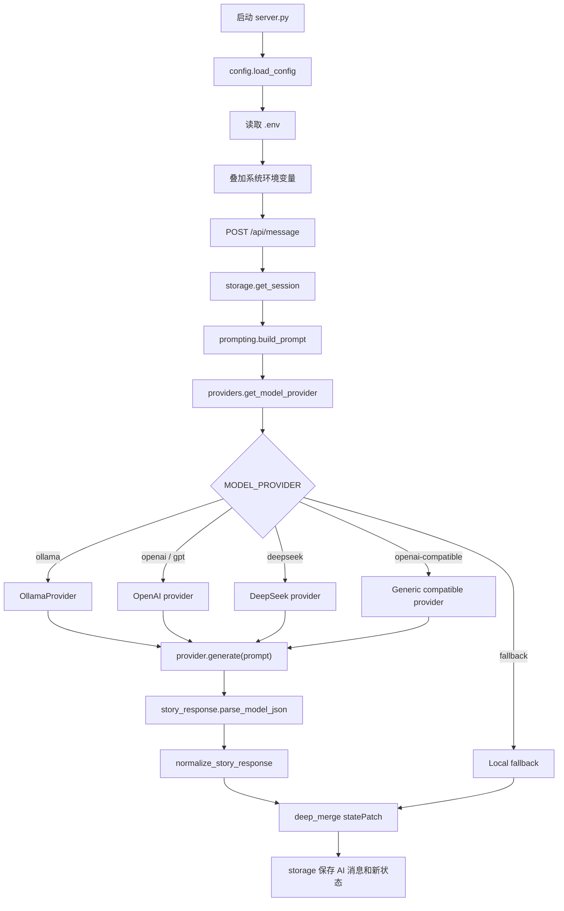

# 多模型接入 Workflow

## 目标

让 AI Roleplay Engine 可以通过 `.env` 切换不同模型，而不是把模型配置写死在代码里。`server.py` 仍然只做 HTTP 入口；模型接入由 `roleplay/config.py` 和 `roleplay/providers.py` 负责。

## 配置优先级

```text
真实系统环境变量 > 项目根目录 .env > 代码默认值
```

建议流程：

```powershell
Copy-Item .env.example .env
notepad .env
.\.venv\Scripts\python.exe server.py
```

不要把真实 API key 提交到代码仓库。

## 代码框架

```text
ai-roleplay-engine/
  .env.example                 # 可复制的模型配置模板
  .env                         # 本地私有配置，按需创建
  server.py                    # HTTP 入口：路由、JSON 读写、启动服务
  roleplay/
    config.py                  # 读取 .env 和系统环境变量
    defaults.py                # 默认角色、世界观、初始状态、fallback 选项
    storage.py                 # SQLite session/message/state 持久化
    prompting.py               # PromptBuilder
    providers.py               # 模型 provider 接口、路由和具体适配器
    story_response.py          # 模型 JSON 解析、normalize、fallback 回复
    story_engine.py            # 剧情生成编排
    utils.py                   # 通用工具
```

## 调用链



## Provider 协议

所有模型 provider 都实现同一个接口：

```python
class ModelProvider:
    provider_id = "provider-name"

    def metadata(self) -> dict[str, str]:
        ...

    def generate(self, prompt: str) -> dict[str, Any]:
        ...
```

约定：

- `generate(prompt)` 接收统一 prompt。
- provider 内部负责鉴权、HTTP 请求、超时和响应提取。
- provider 返回前必须把模型响应转换成统一剧情对象。
- 连接失败、配置错误、JSON 解析失败会在 `story_engine.generate_story()` 统一 fallback。

## 统一输出协议

模型最终需要产出：

```json
{
  "sceneText": "场景叙述",
  "dialogue": [
    {
      "speaker": "角色名或旁白",
      "text": "台词"
    }
  ],
  "choices": [
    {
      "id": "choice_1",
      "text": "用户可执行行动",
      "type": "dialogue"
    }
  ],
  "statePatch": {},
  "memoryNotes": []
}
```

`story_response.normalize_story_response()` 会补足 3 个选项，并兼容 `sceneText/narration`、`text/label` 等轻微字段差异。

## .env 示例

### Ollama

```dotenv
MODEL_PROVIDER=ollama
MODEL_NAME=llama3.1
OLLAMA_URL=http://localhost:11434/api/generate
```

### GPT / OpenAI

`MODEL_PROVIDER=openai` 和 `MODEL_PROVIDER=gpt` 等价。

```dotenv
MODEL_PROVIDER=openai
OPENAI_API_KEY=sk-...
OPENAI_MODEL=gpt-4o-mini
OPENAI_BASE_URL=https://api.openai.com/v1
```

也可以用通用字段覆盖：

```dotenv
MODEL_PROVIDER=gpt
MODEL_API_KEY=sk-...
MODEL_NAME=gpt-4o-mini
MODEL_BASE_URL=https://api.openai.com/v1
```

### DeepSeek

DeepSeek 走 OpenAI-compatible Chat Completions 格式，但有独立快捷 provider。

```dotenv
MODEL_PROVIDER=deepseek
DEEPSEEK_API_KEY=sk-...
DEEPSEEK_MODEL=deepseek-chat
DEEPSEEK_BASE_URL=https://api.deepseek.com
```

也可以用通用字段覆盖：

```dotenv
MODEL_PROVIDER=deepseek
MODEL_API_KEY=sk-...
MODEL_NAME=deepseek-chat
MODEL_BASE_URL=https://api.deepseek.com
```

### 其他 OpenAI-compatible 服务

适合 OpenRouter、通义千问兼容网关、SiliconFlow、Moonshot/Kimi 兼容网关、智谱兼容网关、本地 vLLM、LiteLLM、LM Studio 等 `/chat/completions` 服务。

```dotenv
MODEL_PROVIDER=openai-compatible
MODEL_NAME=provider-model-name
MODEL_BASE_URL=https://your-provider.example/v1
MODEL_API_KEY=your-api-key-if-needed
```

如果目标服务不支持 `response_format`：

```dotenv
OPENAI_RESPONSE_FORMAT=none
```

### Fallback

```dotenv
MODEL_PROVIDER=fallback
```

## 新增模型步骤

1. 如果供应商兼容 `/chat/completions`，优先使用 `MODEL_PROVIDER=openai-compatible`，只改 `.env`。
2. 如果需要独立快捷入口，在 `roleplay/config.py` 增加供应商专属字段，例如 `FOO_API_KEY/FOO_MODEL/FOO_BASE_URL`。
3. 在 `roleplay/providers.py` 的 `get_model_provider(config)` 注册 `MODEL_PROVIDER=foo`。
4. 如果供应商不是 OpenAI-compatible，再新增一个 `ModelProvider` 子类。
5. 用 `GET /health` 确认当前 provider、model、url。
6. 用 `POST /api/message` 验证成功路径和 fallback 路径。

## 失败策略

- `.env` 缺少 API key 或模型名：返回 fallback，原因写入 `memoryNotes`。
- HTTP 连接失败或超时：返回 fallback。
- 模型输出不是合法 JSON：返回 fallback。
- Compatible 服务不支持 `response_format`：自动去掉 `response_format` 重试一次，再失败才 fallback。

