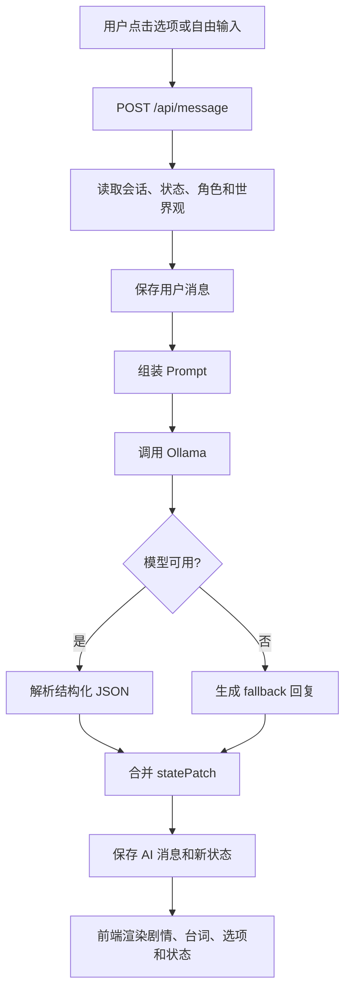

# 第一版 Workflow

## 目标

第一版只做一件事：让本地项目可以跑通“AI 推进剧情 -> 给出选项 -> 用户选择或自由输入 -> 更新剧情状态 -> 继续”的闭环。

## 运行流程



## AI 输出协议

模型必须返回：

```json
{
  "sceneText": "场景叙述",
  "dialogue": [
    {
      "speaker": "凌夜",
      "text": "台词"
    }
  ],
  "choices": [
    {
      "id": "choice_1",
      "text": "追问信件的来历",
      "type": "dialogue"
    },
    {
      "id": "choice_2",
      "text": "检查房间里的异常",
      "type": "action"
    },
    {
      "id": "choice_3",
      "text": "沉默观察凌夜的反应",
      "type": "observe"
    }
  ],
  "statePatch": {
    "mood": "警觉"
  },
  "memoryNotes": []
}
```

## 状态设计

当前 MVP 使用一个 JSON 状态对象保存剧情连续性：

```json
{
  "chapter": 1,
  "scene": "旧城旅馆",
  "location": "二楼房间",
  "time": "雨夜",
  "mainGoal": "查清神秘信件的来源",
  "mood": "紧张",
  "flags": {
    "hasLetter": true,
    "metLingye": true,
    "doorLocked": false
  },
  "relationship": {
    "凌夜": {
      "trust": 3,
      "tension": 4,
      "affection": 1
    }
  },
  "inventory": ["神秘信件", "旧钥匙"],
  "activeQuests": [
    {
      "id": "letter_origin",
      "title": "调查信件来源",
      "status": "active"
    }
  ]
}
```

## 第一版边界

已做：

- 单角色、单世界观
- 单会话继续推进
- SQLite 持久化
- 选项和自由输入
- Ollama + fallback

暂不做：

- 多角色卡管理
- 世界书检索
- 长期记忆向量库
- 分支时间线
- 前端编辑器
